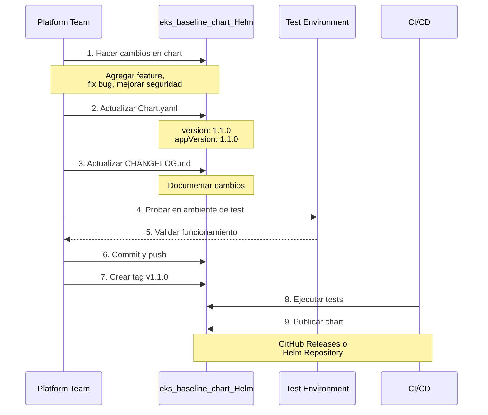
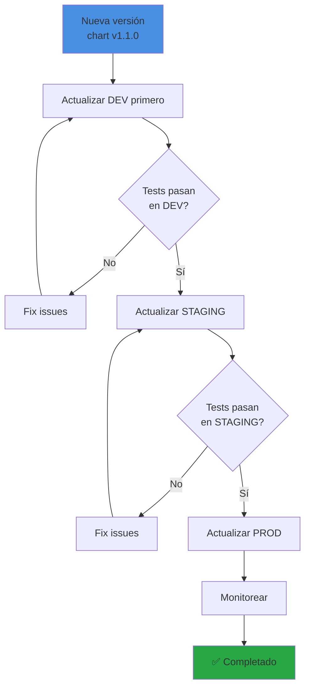
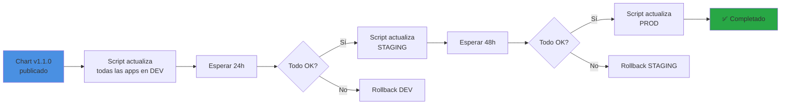
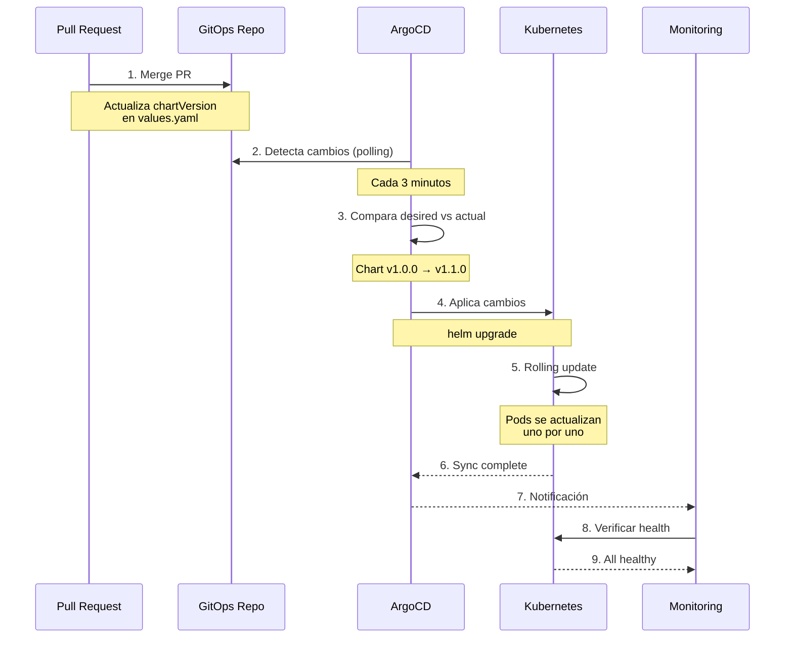

# Actualización del Chart Transversal - Flujo Completo

## 📋 Índice
1. [Visión General](#visión-general)
2. [Flujo Paso a Paso](#flujo-paso-a-paso)
3. [Estrategias de Actualización](#estrategias-de-actualización)
4. [Ejemplos Prácticos](#ejemplos-prácticos)
5. [Rollback](#rollback)
6. [Mejores Prácticas](#mejores-prácticas)

---

## Visión General

El **Chart Transversal** (`eks_baseline_chart_Helm`) es usado por **todas las aplicaciones**. Cuando se actualiza, hay que decidir cómo propagar los cambios a las aplicaciones existentes.

### Arquitectura Actual

```
eks_baseline_chart_Helm (GitHub)
    ↓ (referenciado por)
gitops-apps/values/
    ├── dev/
    │   ├── app1/values.yaml  → chart: v1.0.0
    │   ├── app2/values.yaml  → chart: v1.0.0
    │   └── app3/values.yaml  → chart: v1.0.0
    ├── staging/
    │   ├── app1/values.yaml  → chart: v1.0.0
    │   └── app2/values.yaml  → chart: v1.0.0
    └── prod/
        ├── app1/values.yaml  → chart: v1.0.0
        └── app2/values.yaml  → chart: v1.0.0
```

---

## Flujo Paso a Paso

### Fase 1: Desarrollo y Testing del Chart



#### Comandos Específicos

```bash
# 1. Clonar el repositorio del chart
git clone https://github.com/bcocbo/eks_baseline_chart_Helm.git
cd eks_baseline_chart_Helm

# 2. Hacer cambios (ejemplo: agregar probes mejorados)
vim templates/deployment.yaml

# 3. Actualizar versión en Chart.yaml
vim Chart.yaml
# Cambiar: version: 1.1.0

# 4. Actualizar CHANGELOG
vim CHANGELOG.md
# Agregar:
# ## [1.1.0] - 2025-12-07
# ### Added
# - Improved liveness and readiness probes
# - Added startup probe for slow-starting apps

# 5. Probar localmente
helm lint .
helm template test-release . --values values.yaml

# 6. Commit y tag
git add .
git commit -m "feat: add improved health probes - v1.1.0"
git tag -a v1.1.0 -m "Release v1.1.0: Improved health probes"
git push origin main
git push origin v1.1.0
```

---

### Fase 2: Estrategias de Actualización

Hay **3 estrategias principales** para actualizar las aplicaciones:

#### Estrategia 1: Actualización Manual Selectiva (Recomendada)

**Cuándo usar**: Para cambios importantes o breaking changes



**Proceso**:

```bash
# 1. Actualizar aplicaciones en DEV
cd gitops-apps

# Actualizar app1 en dev
vim values/dev/app1/values.yaml
# Cambiar chartVersion de 1.0.0 a 1.1.0

# Actualizar app2 en dev
vim values/dev/app2/values.yaml
# Cambiar chartVersion de 1.0.0 a 1.1.0

# 2. Crear PR
git checkout -b update-chart-to-v1.1.0-dev
git add values/dev/
git commit -m "chore: update chart to v1.1.0 in dev environment"
git push origin update-chart-to-v1.1.0-dev

# Crear PR en GitHub
# Título: "Update chart to v1.1.0 in DEV"
# Descripción: Lista de cambios del CHANGELOG

# 3. Después de aprobar y merge, ArgoCD sincroniza automáticamente

# 4. Monitorear en DEV por 24-48 horas

# 5. Si todo OK, repetir para STAGING
git checkout -b update-chart-to-v1.1.0-staging
vim values/staging/app1/values.yaml
# ... repetir proceso

# 6. Finalmente PROD
git checkout -b update-chart-to-v1.1.0-prod
vim values/prod/app1/values.yaml
# ... repetir proceso
```

#### Estrategia 2: Actualización Automática por Entorno

**Cuándo usar**: Para patches y mejoras menores



**Script de Actualización**:

```bash
#!/bin/bash
# update-chart-version.sh

CHART_VERSION=$1
ENVIRONMENT=$2

if [ -z "$CHART_VERSION" ] || [ -z "$ENVIRONMENT" ]; then
    echo "Usage: $0 <chart-version> <environment>"
    echo "Example: $0 1.1.0 dev"
    exit 1
fi

echo "Updating all apps in $ENVIRONMENT to chart version $CHART_VERSION"

# Encontrar todos los values.yaml en el entorno
find values/$ENVIRONMENT -name "values.yaml" | while read file; do
    echo "Updating $file"
    
    # Usar yq para actualizar la versión del chart
    yq eval ".chartVersion = \"$CHART_VERSION\"" -i "$file"
done

echo "✅ All apps in $ENVIRONMENT updated to chart version $CHART_VERSION"
echo "Next steps:"
echo "1. Review changes: git diff"
echo "2. Create PR: git checkout -b update-chart-$CHART_VERSION-$ENVIRONMENT"
echo "3. Commit: git add . && git commit -m 'chore: update chart to v$CHART_VERSION in $ENVIRONMENT'"
echo "4. Push: git push origin update-chart-$CHART_VERSION-$ENVIRONMENT"
```

**Uso**:

```bash
# Actualizar DEV
./update-chart-version.sh 1.1.0 dev

# Revisar cambios
git diff

# Crear PR
git checkout -b update-chart-1.1.0-dev
git add .
git commit -m "chore: update chart to v1.1.0 in dev"
git push origin update-chart-1.1.0-dev

# Después de 24h y validación, actualizar STAGING
./update-chart-version.sh 1.1.0 staging

# Después de 48h y validación, actualizar PROD
./update-chart-version.sh 1.1.0 prod
```

#### Estrategia 3: Actualización con Renovate/Dependabot

**Cuándo usar**: Para automatización completa con revisión

```yaml
# .github/renovate.json en gitops-apps
{
  "extends": ["config:base"],
  "packageRules": [
    {
      "matchDatasources": ["helm"],
      "matchPackageNames": ["eks_baseline_chart_Helm"],
      "schedule": ["every weekend"],
      "automerge": false,
      "labels": ["chart-update", "needs-review"]
    }
  ],
  "helm-values": {
    "fileMatch": ["values/.+/values\\.yaml$"]
  }
}
```

---

### Fase 3: Sincronización con ArgoCD



---

## Ejemplos Prácticos

### Ejemplo 1: Agregar Startup Probe

**Cambio en el Chart**:

```yaml
# templates/deployment.yaml (v1.1.0)
spec:
  containers:
  - name: {{ .Chart.Name }}
    # ... existing config ...
    
    # NUEVO: Startup probe para apps que tardan en iniciar
    {{- if .Values.startupProbe.enabled }}
    startupProbe:
      httpGet:
        path: {{ .Values.startupProbe.path }}
        port: {{ .Values.service.port }}
      initialDelaySeconds: {{ .Values.startupProbe.initialDelaySeconds }}
      periodSeconds: {{ .Values.startupProbe.periodSeconds }}
      failureThreshold: {{ .Values.startupProbe.failureThreshold }}
    {{- end }}
```

**Actualización de Apps**:

```bash
# 1. Actualizar chart version en gitops-apps
cd gitops-apps

# 2. Para cada app, actualizar values.yaml
vim values/dev/my-app/values.yaml
```

```yaml
# values/dev/my-app/values.yaml
chartVersion: "1.1.0"  # Cambiar de 1.0.0

# Opcionalmente, habilitar la nueva feature
startupProbe:
  enabled: true
  path: /health
  initialDelaySeconds: 0
  periodSeconds: 10
  failureThreshold: 30
```

**Resultado**:
- ArgoCD detecta el cambio
- Descarga chart v1.1.0
- Aplica el nuevo deployment con startup probe
- Pods se reinician con la nueva configuración

### Ejemplo 2: Cambio de Security Context

**Cambio en el Chart**:

```yaml
# templates/deployment.yaml (v1.2.0)
spec:
  securityContext:
    runAsNonRoot: true
    runAsUser: 1000
    fsGroup: 1000
    # NUEVO: Mejoras de seguridad
    seccompProfile:
      type: RuntimeDefault
    capabilities:
      drop:
        - ALL
```

**Impacto**: Este es un cambio que puede romper apps que requieren permisos especiales.

**Proceso de Actualización**:

```bash
# 1. Actualizar UNA app en DEV primero
vim values/dev/test-app/values.yaml
# chartVersion: "1.2.0"

# 2. Crear PR solo para esta app
git checkout -b test-chart-v1.2.0-security
git add values/dev/test-app/
git commit -m "test: update test-app to chart v1.2.0 for security testing"
git push

# 3. Merge y observar
# - ¿La app inicia correctamente?
# - ¿Hay errores de permisos?
# - ¿Los logs muestran problemas?

# 4. Si funciona, actualizar el resto gradualmente
# Si no funciona, ajustar el chart o los values de la app
```

---

## Rollback

### Rollback Rápido

Si una actualización causa problemas:

```bash
# Opción 1: Revertir el commit en GitOps
cd gitops-apps
git revert <commit-hash>
git push

# ArgoCD sincroniza automáticamente y vuelve a la versión anterior

# Opción 2: Rollback manual en ArgoCD
argocd app rollback my-app <revision-id>

# Opción 3: Actualizar values.yaml manualmente
vim values/prod/my-app/values.yaml
# Cambiar chartVersion de 1.1.0 a 1.0.0
git add .
git commit -m "rollback: revert chart to v1.0.0 for my-app"
git push
```

### Rollback por Entorno

```bash
# Rollback solo en PROD, mantener DEV y STAGING en nueva versión
find values/prod -name "values.yaml" -exec sed -i 's/chartVersion: "1.1.0"/chartVersion: "1.0.0"/g' {} \;

git add values/prod/
git commit -m "rollback: revert all prod apps to chart v1.0.0"
git push
```

---

## Mejores Prácticas

### 1. Versionado Semántico

```
MAJOR.MINOR.PATCH

1.0.0 → 1.0.1  (PATCH: bug fixes, no breaking changes)
1.0.0 → 1.1.0  (MINOR: new features, backward compatible)
1.0.0 → 2.0.0  (MAJOR: breaking changes)
```

**Estrategia por tipo**:
- **PATCH**: Actualización automática en todos los entornos
- **MINOR**: Actualización gradual (dev → staging → prod)
- **MAJOR**: Actualización manual app por app

### 2. Testing Progresivo

```
1. Test en ambiente local (helm template)
2. Deploy en DEV (todas las apps)
3. Esperar 24h, monitorear
4. Deploy en STAGING (subset de apps)
5. Esperar 48h, monitorear
6. Deploy en PROD (app por app)
```

### 3. Documentación

Cada actualización debe incluir:

```markdown
## Chart Update: v1.0.0 → v1.1.0

### Changes
- Added startup probe support
- Improved security context
- Fixed ingress annotations

### Breaking Changes
None

### Migration Guide
1. Update chartVersion in values.yaml
2. Optionally enable startupProbe
3. No other changes required

### Rollback Plan
Revert chartVersion to 1.0.0 if issues occur

### Testing Checklist
- [ ] App starts successfully
- [ ] Health checks pass
- [ ] No permission errors
- [ ] Ingress works correctly
```

### 4. Monitoreo Post-Actualización

```bash
# Verificar sync status
argocd app get my-app

# Ver logs de pods
kubectl logs -n dev -l app=my-app --tail=100

# Verificar eventos
kubectl get events -n dev --sort-by='.lastTimestamp' | grep my-app

# Verificar métricas
# - CPU/Memory usage
# - Request rate
# - Error rate
# - Response time
```

### 5. Comunicación

Antes de actualizar en PROD:

1. **Notificar a los equipos** con 48h de anticipación
2. **Documentar cambios** en Confluence/Wiki
3. **Programar ventana de mantenimiento** si es necesario
4. **Tener plan de rollback** listo
5. **Monitorear activamente** durante y después

---

## Automatización Completa (Avanzado)

### Pipeline de Actualización

```yaml
# .github/workflows/update-chart.yaml
name: Update Chart Version

on:
  workflow_dispatch:
    inputs:
      chart_version:
        description: 'Chart version to update to'
        required: true
      environment:
        description: 'Environment to update'
        required: true
        type: choice
        options:
          - dev
          - staging
          - prod

jobs:
  update-chart:
    runs-on: ubuntu-latest
    steps:
      - uses: actions/checkout@v3
      
      - name: Update chart version
        run: |
          find values/${{ inputs.environment }} -name "values.yaml" | while read file; do
            yq eval ".chartVersion = \"${{ inputs.chart_version }}\"" -i "$file"
          done
      
      - name: Create PR
        uses: peter-evans/create-pull-request@v5
        with:
          title: "Update chart to v${{ inputs.chart_version }} in ${{ inputs.environment }}"
          body: |
            Automated chart update
            
            - Chart version: ${{ inputs.chart_version }}
            - Environment: ${{ inputs.environment }}
            - Apps affected: $(find values/${{ inputs.environment }} -name "values.yaml" | wc -l)
          branch: update-chart-${{ inputs.chart_version }}-${{ inputs.environment }}
          labels: chart-update, ${{ inputs.environment }}
```

---

## Resumen

### Flujo Recomendado

1. **Desarrollar** nueva versión del chart
2. **Probar** localmente y en ambiente de test
3. **Publicar** nueva versión con tag
4. **Actualizar DEV** (todas las apps)
5. **Monitorear** 24-48 horas
6. **Actualizar STAGING** (subset de apps)
7. **Monitorear** 48-72 horas
8. **Actualizar PROD** (app por app o todas)
9. **Monitorear** continuamente
10. **Documentar** lecciones aprendidas

### Tiempos Estimados

| Fase | Tiempo |
|------|--------|
| Desarrollo del chart | 1-3 días |
| Testing local | 1 día |
| Deploy en DEV | 1 hora |
| Monitoreo DEV | 1-2 días |
| Deploy en STAGING | 1 hora |
| Monitoreo STAGING | 2-3 días |
| Deploy en PROD | 2-4 horas |
| Monitoreo PROD | 1 semana |
| **Total** | **2-3 semanas** |

---

**Nota**: Este proceso asegura que los cambios en el chart transversal se propaguen de manera segura y controlada a todas las aplicaciones, minimizando el riesgo de interrupciones.
