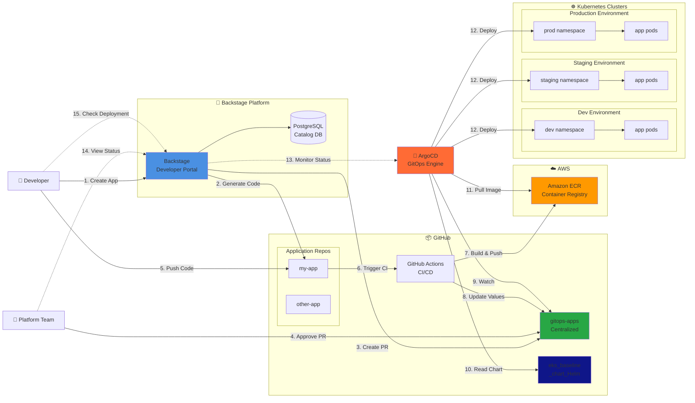
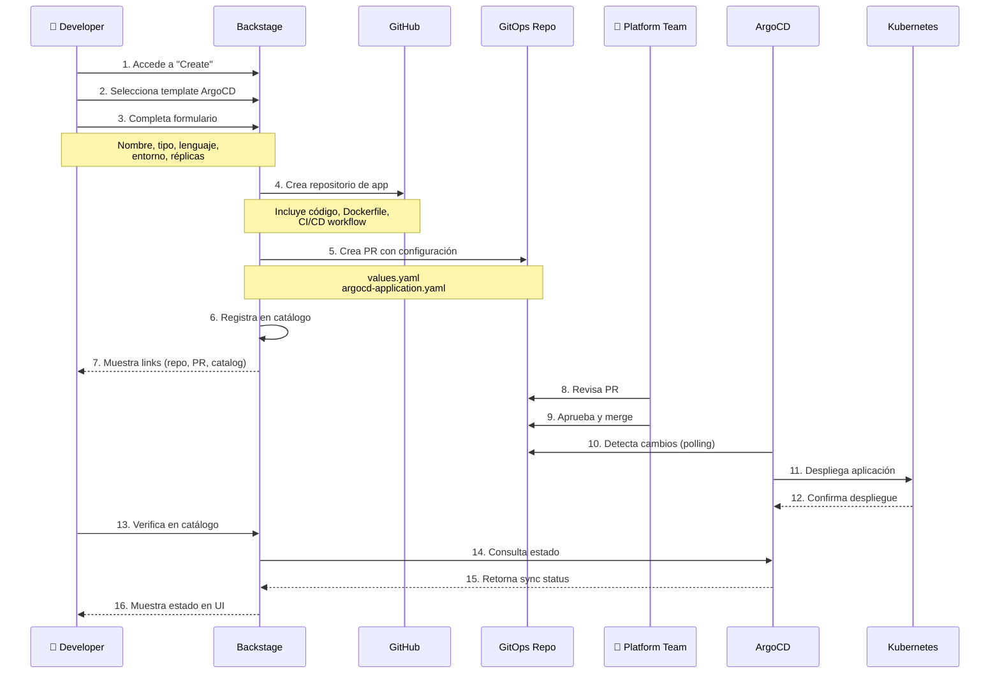
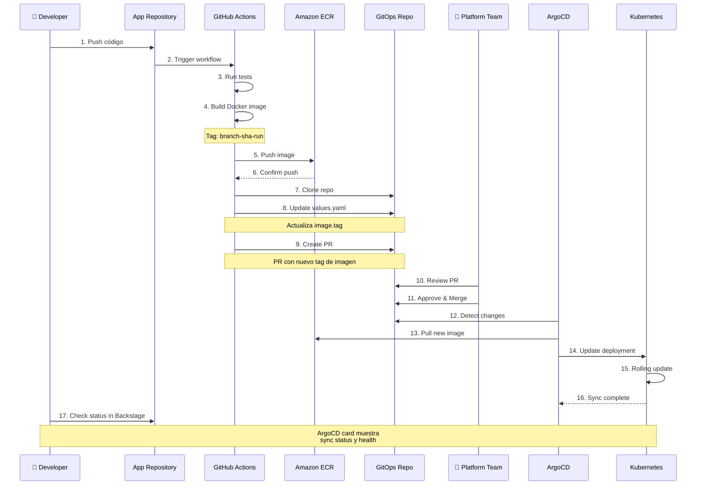
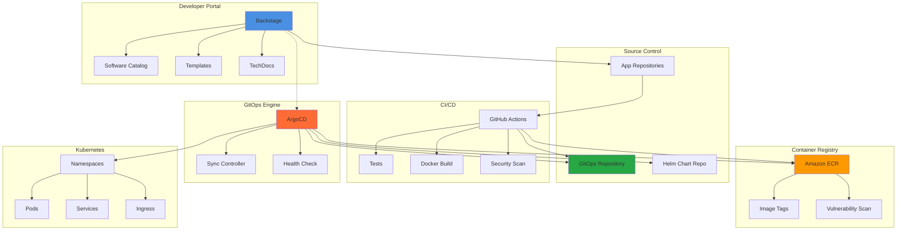

# Diagrama de Arquitectura - Backstage GitOps Platform

## Arquitectura Completa



## Flujo Detallado de Creación de Aplicación



## Flujo de CI/CD y Actualización



## Componentes y Responsabilidades



## Arquitectura de Seguridad

```mermaid
graph TB
    subgraph "Authentication & Authorization"
        AUTH[Backstage Auth]
        RBAC[ArgoCD RBAC]
        OIDC[AWS OIDC]
    end
    
    subgraph "Secrets Management"
        ENV[.env file<br/>local only]
        K8S_SEC[Kubernetes Secrets]
        GH_SEC[GitHub Secrets]
    end
    
    subgraph "Network Security"
        TLS[TLS/HTTPS]
        NETPOL[Network Policies]
        ING_AUTH[Ingress Auth]
    end
    
    subgraph "Container Security"
        NONROOT[Non-root User]
        SECCTX[Security Context]
        READONLY[Read-only FS]
        SCAN[Image Scanning]
    end
    
    AUTH --> RBAC
    RBAC --> OIDC
    ENV --> K8S_SEC
    K8S_SEC --> GH_SEC
    TLS --> NETPOL
    NETPOL --> ING_AUTH
    NONROOT --> SECCTX
    SECCTX --> READONLY
    READONLY --> SCAN
    
    style AUTH fill:#E74C3C
    style K8S_SEC fill:#E74C3C
    style TLS fill:#E74C3C
    style NONROOT fill:#E74C3C
```



## Estructura de Repositorios

```
📦 Repositorios
│
├── 🏢 backstage-app-poc-main (este repo)
│   ├── examples/argocd-template/     # Template de Backstage
│   ├── packages/app/                 # Frontend
│   ├── packages/backend/             # Backend
│   └── charts/eks_baseline_chart_Helm/  # Chart local
│
├── 📦 eks_baseline_chart_Helm (GitHub)
│   ├── Chart.yaml
│   ├── values.yaml
│   ├── templates/
│   │   ├── deployment.yaml
│   │   ├── service.yaml
│   │   ├── ingress.yaml
│   │   └── ...
│   └── README.md
│
├── 🔄 gitops-apps (GitHub)
│   ├── values/
│   │   ├── dev/
│   │   │   └── my-app/
│   │   │       └── values.yaml
│   │   ├── staging/
│   │   └── prod/
│   ├── argocd/
│   │   ├── projects/
│   │   │   ├── dev-project.yaml
│   │   │   ├── staging-project.yaml
│   │   │   └── prod-project.yaml
│   │   ├── applications/
│   │   │   ├── dev/
│   │   │   ├── staging/
│   │   │   └── prod/
│   │   └── app-of-apps.yaml
│   └── charts/
│
└── 📱 my-app (GitHub - generado por template)
    ├── src/                          # Código fuente
    ├── Dockerfile                    # Multi-stage build
    ├── .github/workflows/ci.yaml     # CI/CD pipeline
    ├── catalog-info.yaml             # Metadata de Backstage
    └── README.md
```

## Flujo de Datos

```
┌─────────────┐
│  Developer  │
└──────┬──────┘
       │
       ▼
┌─────────────────────────────────────────────────────────┐
│                    Backstage                             │
│  ┌──────────┐  ┌──────────┐  ┌──────────┐             │
│  │ Catalog  │  │Templates │  │ TechDocs │             │
│  └──────────┘  └──────────┘  └──────────┘             │
└──────┬──────────────────────────────────────────────────┘
       │
       ▼
┌─────────────────────────────────────────────────────────┐
│                      GitHub                              │
│  ┌──────────────┐  ┌──────────────┐  ┌──────────────┐ │
│  │  App Repos   │  │ GitOps Repo  │  │  Helm Chart  │ │
│  └──────┬───────┘  └──────┬───────┘  └──────────────┘ │
└─────────┼──────────────────┼──────────────────────────┘
          │                  │
          ▼                  │
    ┌──────────┐            │
    │ CI/CD    │            │
    │ Pipeline │            │
    └────┬─────┘            │
         │                  │
         ▼                  │
    ┌──────────┐            │
    │ ECR      │            │
    │ Registry │            │
    └────┬─────┘            │
         │                  │
         └──────────┬───────┘
                    │
                    ▼
              ┌──────────┐
              │ ArgoCD   │
              └────┬─────┘
                   │
                   ▼
         ┌──────────────────┐
         │   Kubernetes      │
         │  ┌────┐ ┌────┐   │
         │  │Dev │ │Prod│   │
         │  └────┘ └────┘   │
         └──────────────────┘
```

## Tecnologías Utilizadas

| Componente | Tecnología | Propósito |
|------------|-----------|-----------|
| **Developer Portal** | Backstage | Catálogo de servicios, templates |
| **Source Control** | GitHub | Repositorios de código |
| **CI/CD** | GitHub Actions | Automatización de builds |
| **Container Registry** | Amazon ECR | Almacenamiento de imágenes |
| **GitOps Engine** | ArgoCD | Continuous Deployment |
| **Orchestration** | Kubernetes (EKS) | Ejecución de contenedores |
| **Package Manager** | Helm | Gestión de configuración |
| **Database** | PostgreSQL | Catálogo de Backstage |
| **Authentication** | AWS OIDC | Autenticación sin keys |

## Ventajas de esta Arquitectura

### 🎯 Escalabilidad
- Soporta 100+ aplicaciones
- Múltiples equipos independientes
- Crecimiento horizontal

### 🔐 Seguridad
- Separación de responsabilidades
- Auditoría completa
- Secrets management
- RBAC en todos los niveles

### 🚀 Velocidad
- Despliegues automatizados
- CI/CD integrado
- Rollbacks rápidos

### 👁️ Visibilidad
- Vista centralizada
- Estado en tiempo real
- Historial completo

### 📊 Governance
- Aprobaciones requeridas
- Políticas por entorno
- Compliance automático

---

**Nota**: Este diagrama representa la arquitectura implementada en este proyecto.
Para visualizar los diagramas Mermaid, abre este archivo en GitHub o en un editor que soporte Mermaid.
